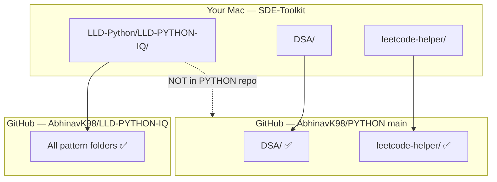
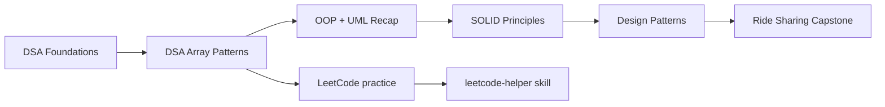

# SDE Toolkit

> Your local interview-prep workspace for **DSA**, **Low-Level Design (LLD)**, and **LeetCode practice**.

---

## What's inside

```
SDE-Toolkit/                    ← this folder (GitHub: AbhinavK98/PYTHON)
├── DSA/                        ← ✅ tracked on main
├── LLD-Python/
│   └── LLD-PYTHON-IQ/          ← ⚠️ separate git repo (not in PYTHON repo yet)
└── leetcode-helper/            ← Codex skill for LeetCode explanations
```

---

## Quick links

| Track | Start here | Git status |
|-------|------------|------------|
| **DSA** | [DSA/README.md](DSA/README.md) | Part of this repo (`main`) |
| **LLD (Python)** | [LLD-Python/LLD-PYTHON-IQ/README.md](LLD-Python/LLD-PYTHON-IQ/README.md) | Separate repo → [LLD-PYTHON-IQ](https://github.com/AbhinavK98/LLD-PYTHON-IQ) |
| **LeetCode Helper** | [leetcode-helper/README.md](leetcode-helper/README.md) | Part of this repo |

---

## Why you only see `main` on GitHub

Your **SDE-Toolkit** folder is connected to:

**https://github.com/AbhinavK98/PYTHON**

That remote currently has:

- **One branch:** `main`
- **DSA content** — committed and visible on GitHub
- **No LLD content** — `LLD-Python/` lives on disk but is **not pushed** to PYTHON because it has its own `.git` folder (nested repo)



---

## How to open each course locally

### DSA (in this repo)

```bash
cd DSA
# Start with foundations
open DSA-Foundations/README.md   # or read in Cursor
```

### LLD (separate repo inside folder)

```bash
cd "LLD-Python/LLD-PYTHON-IQ"
# Each pattern folder has NOTES.md, FLOW.md, UML.md, etc.
open README.md
```

> **💡 In Cursor:** Use the file explorer — expand `DSA/` and `LLD-Python/LLD-PYTHON-IQ/`. Both exist locally even if GitHub only shows DSA.

---

## Recommended study order



| Phase | Where |
|-------|--------|
| 1 — DSA basics | [DSA/DSA-Foundations](DSA/DSA-Foundations/README.md) |
| 2 — Array patterns | [DSA/Arrays](DSA/Arrays/README.md) |
| 3 — OOP + UML | [LLD …/1. OOPS Recap](LLD-Python/LLD-PYTHON-IQ/1.%20OOPS%20Recap/NOTES.md) |
| 4 — SOLID | [LLD …/2. SOLID Principles](LLD-Python/LLD-PYTHON-IQ/2.%20SOLID%20Principles/NOTES.md) |
| 5 — Patterns 3–22 | [LLD README roadmap](LLD-Python/LLD-PYTHON-IQ/README.md) |

---

## If you want everything on one GitHub repo

You have three common options:

### Option A — Git submodule (keep separate repos, link in PYTHON)

```bash
# From SDE-Toolkit root — adds LLD as a linked sub-repo
git submodule add https://github.com/AbhinavK98/LLD-PYTHON-IQ.git LLD-Python/LLD-PYTHON-IQ
```

GitHub will show LLD as a folder that points to the other repo.

### Option B — Merge LLD into PYTHON (single repo)

```bash
# Remove nested .git from LLD, then add to parent
rm -rf LLD-Python/LLD-PYTHON-IQ/.git
git add LLD-Python/
git commit -m "Add LLD Python course"
git push origin main
```

### Option C — Keep separate (current setup)

- **PYTHON repo** → DSA + leetcode-helper  
- **LLD-PYTHON-IQ repo** → all design patterns  
- Use this README as the local index

---

## Repos at a glance

| Local path | GitHub remote | Branch |
|------------|---------------|--------|
| `SDE-Toolkit/` (root) | `AbhinavK98/PYTHON` | `main` |
| `LLD-Python/LLD-PYTHON-IQ/` | `AbhinavK98/LLD-PYTHON-IQ` | `main` (+ `Python-LLD-IQ`) |

---

## LLD documentation structure

Every pattern folder includes:

| File | Purpose |
|------|---------|
| `NOTES.md` | Deep concept explanation |
| `FLOW.md` | Execution flow |
| `UML.md` | Diagrams |
| `INTERVIEW.md` | Q&A |
| `CHEATSHEET.md` | Quick revision |

---

*Open this folder in Cursor to access all tracks. GitHub `PYTHON` shows DSA; LLD is in its own repo or locally under `LLD-Python/`.*
